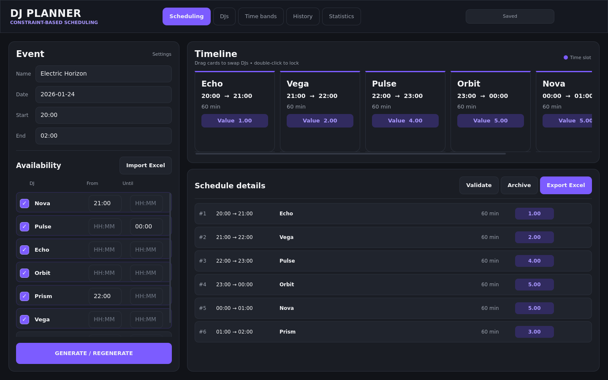
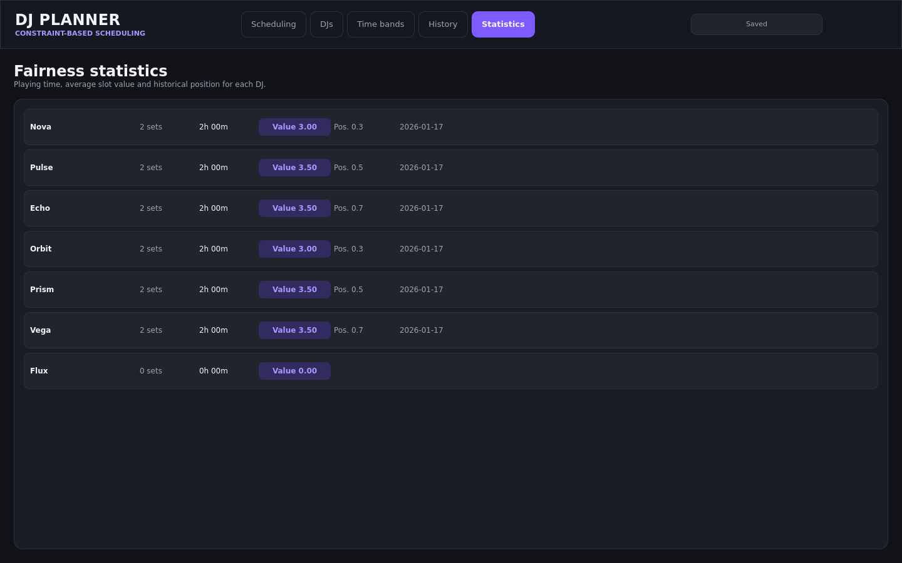

# DJ Planner

**Constraint-based scheduling. History-aware rotation. A desktop interface built for live events.**

DJ Planner assigns DJs to event time slots while respecting availability and balancing time-slot rotation across an event series. It combines a Python constraint solver with a dark Qt Quick desktop interface.



## Why this project?

A lineup has to satisfy several competing requirements: every available DJ should play, nobody should be scheduled outside their availability, and the same people should not always get the opening or peak-time slots. Last-minute changes make a spreadsheet increasingly difficult to maintain.

DJ Planner separates strict scheduling rules from fairness preferences. Generate a feasible lineup, adjust it manually, validate it, then archive the event so its results influence the next one.

## Features

- One stage, one DJ per slot, exactly one appearance per present DJ.
- Availability toggles, earliest start and latest finish per DJ.
- Events that continue after midnight.
- Slot durations rounded toward 15-minute increments, with a final remainder slot.
- Weighted time bands, history-based position rotation and cumulative playing-time balancing.
- Drag-to-swap timeline, double-click slot locking and validation before export or archive.
- Add or deactivate DJs while retaining their history.
- Local SQLite storage, including the current lineup and manual changes.
- Legacy Excel workbook import and formatted schedule export.
- An isolated demo containing seven fictional stage names, two historical events and one upcoming event.

The interface, application messages, Excel exports and documentation are in **English**. Existing French-format legacy workbooks can still be imported.

## Quick start

Python **3.11 or newer** and a desktop environment are required. Python 3.12 is the locally verified baseline. Dependency wheels must be available for your operating system and architecture.

```bash
git clone https://github.com/jojow-bg/DJ-Planner.git
cd DJ-Planner
```

### Linux / macOS

```bash
python3 -m venv .venv
source .venv/bin/activate
python -m pip install --upgrade pip
python -m pip install .
python -m dj_planner --demo
```

### Windows — PowerShell

Activation is optional; invoking the environment directly avoids shell policy changes.

```powershell
py -3.12 -m venv .venv
.\.venv\Scripts\python.exe -m pip install --upgrade pip
.\.venv\Scripts\python.exe -m pip install .
.\.venv\Scripts\python.exe -m dj_planner --demo
```

The demo uses a temporary database. Its edits are discarded on exit; your normal data is untouched.

### Start your own project

```bash
python -m dj_planner
```

Or, inside an activated environment, run `dj-planner`. Normal startup creates an empty roster and default time-value bands. No real names or event data are bundled.

To use a specific database, including a copy of a previous SQLite database:

```bash
python -m dj_planner --database /path/to/planner.sqlite3
```

Use the equivalent quoted Windows path when needed. Existing data is never imported automatically from the repository directory. Back up an older database before opening it with a new version.

## Example workflow

1. Open **DJs**, enter stage names and click **+ Add**.
2. In **Scheduling**, set the event name, date, start and end time.
3. Mark present DJs and enter optional **From** / **Until** limits in `HH:MM` format.
4. Click **GENERATE / REGENERATE**. If no solution exists, the message lists each DJ's possible slots.
5. Drag one timeline card onto another to swap DJs. Double-click a card to lock or unlock its assignment. Scroll horizontally for later slots.
6. Click **Validate**. A manual swap may violate availability; the application flags this and blocks archive/export until corrected.
7. Click **Export Excel**, then **Archive** once the lineup is final.
8. Configure the next event. Archived sets now influence its fairness objective. Review or clear old slot locks before regenerating a different event.

In the demo, **Nova** arrives at 21:00, **Prism** at 22:00, **Pulse** must finish by midnight, and **Flux** is absent. Six present DJs fill the 20:00–02:00 event. Exact assignments may vary when several solutions have similar scores.



Additional views: [DJ management](docs/images/djs.png), [time-value bands](docs/images/bands.png), [event history](docs/images/history.png).

## How the solver works

The application generates contiguous slots first, then uses **OR-Tools CP-SAT** to assign DJs. Each Boolean variable answers one question: “Does this DJ play this slot?”

| Strict rule | Implementation |
| --- | --- |
| One DJ per slot | Exactly one assignment in each slot |
| Every present DJ plays once | Exactly one slot per present DJ |
| Absent DJs do not play | Excluded from candidate assignments |
| Availability windows | The entire set must fit between arrival and departure |
| Locked assignments | The specified DJ is fixed to that slot |
| Continuous coverage | Slot boundaries are generated before optimization |

Among feasible lineups, a weighted objective rewards better slots for DJs with lower historical average slot value, favors extra minutes for DJs with less accumulated playing time, and penalizes positions close to their historical positions.

**Fairness is a preference, not a hard guarantee.** Availability and locks always take priority. Events are planned one at a time using archived history; this is not a simultaneous optimization of an entire season. The solver has an eight-second search limit and can return a feasible solution without proving optimality.

See [solver details](docs/solver.md) for weights, midnight handling and rounding exceptions.

## Architecture and technologies

| Layer | Responsibility | Technology |
| --- | --- | --- |
| Desktop UI | Screens, timeline and interaction | PySide6 / Qt Quick / QML |
| Application bridge | UI models, orchestration and validation | Python |
| Scheduling core | Time arithmetic, constraints, scoring and optimization | Python / OR-Tools CP-SAT |
| Persistence | Roster, settings, current lineup and history | SQLite (`sqlite3`) |
| Spreadsheet integration | Legacy import and schedule export | openpyxl |
| Development | Behavioral tests, static checks and CI | pytest / Ruff / GitHub Actions |

The scheduling core has no Qt or database dependency. The existing module boundaries are retained to keep the code easy to follow.

| Path | Contents |
| --- | --- |
| `src/dj_planner/app.py` | CLI entry point and Qt startup |
| `src/dj_planner/bridge.py` | Python/QML models and actions |
| `src/dj_planner/planner_core.py` | Scheduling and fairness logic |
| `src/dj_planner/data_store.py` | SQLite persistence |
| `src/dj_planner/excel_bridge.py` | Spreadsheet import/export |
| `src/dj_planner/qml/` | Screens, theme and reusable controls |
| `src/dj_planner/data/demo.json` | Fictional, reproducible demo input |
| `tests/` | Solver, storage, Excel and UI regression tests |
| `docs/` | Solver notes, usage details, audit and packaging strategy |
| `scripts/` | Native packaging and screenshot capture helpers |
| `.github/workflows/ci.yml` | Installation, tests, lint and wheel build |

QML and demo resources live inside the package so they remain available after installation from a wheel.

## Local data

By default, the database is stored in the operating system's user-data folder:

| OS | Typical location |
| --- | --- |
| Linux | `~/.local/share/DJPlanner/planner.sqlite3` (respects `XDG_DATA_HOME`) |
| Windows | `%LOCALAPPDATA%\DJPlanner\planner.sqlite3` |
| macOS | `~/Library/Application Support/DJPlanner/planner.sqlite3` |

The application does not need an account or a server. Databases, exports, virtual environments, caches and build outputs are ignored by Git. Copy the database while the application is closed to make a backup.

See [usage and legacy import](docs/usage.md) for spreadsheet compatibility and persistence details.

## Development and tests

```bash
python -m pip install -e ".[dev]"
python -m pytest -q
python -m ruff check .
python -m ruff format --check .
python -m build
```

Tests exercise assignment uniqueness, availability, midnight boundaries, locks, infeasible cases, rotation incentives, duration balancing, manual edits, persistence and spreadsheet output. GUI checks use Qt's offscreen backend; no display server is needed for the tests.

GitHub Actions is configured for Linux, Windows and macOS on Python 3.12, plus Linux on Python 3.11. A configured workflow is not a claim that those jobs have already passed: see [validation status](docs/validation.md).

## Current limitations

- One stage and one currently editable event; archived events provide the history.
- All present DJs must play exactly once. Repeated sets and optional selection are not supported.
- Quarter-hour rounding is conditional: off-grid event boundaries remain off-grid, and very short events fall back to equal fractional durations. The final slot may be **shorter or longer** than the others.
- Fairness weights are fixed. Uneven attendance can bias cumulative-time balancing, and rotation pressure weakens once historical positions cover the full evening.
- The solver currently runs on the UI thread; difficult instances may temporarily block interaction.
- Manual changes can remain invalid until corrected. Validation gates archive and export.
- Archiving the same event twice adds its sets twice; archive once. There is no event-level undo or archive editor yet.
- Legacy Excel import is not a round trip of the new schedule export. It does not import per-DJ time limits or evaluate spreadsheet formulas.
- English UI only, no language switcher, no signed native releases yet.

## Roadmap

- Background solving with progress feedback and cancellation.
- Event management with safe archive replacement and undo.
- Configurable fairness weights and attendance-normalized metrics.
- Explicit strict-grid scheduling mode.
- Accessibility improvements and optional additional languages.
- Validated, signed native distributions after testing on each target OS.

## Packaging

A small PyInstaller helper is provided for future native builds:

```bash
python -m pip install ".[packaging]"
python scripts/build_app.py
```

Build on each target OS; the helper is not a cross-compiler. Native release binaries are not provided or claimed as validated yet. See [packaging strategy](docs/packaging.md).

## License

The project code is distributed under the [MIT License](LICENSE). Dependencies retain their own licenses; review [third-party licensing notes](docs/packaging.md#third-party-licenses) before distributing bundled executables.
